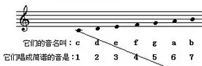

# mml 导引

!!! Tip  inline end "音名"
    1. `a` la音,简谱内的6
    2. `b` si音,简谱内的7
    3. `c` do音,简谱内的1
    4. `d` re音,简谱内的2
    5. `e` mi音,简谱内的3
    6. `f` fa音,简谱内的4
    7. `g` sol音,简谱内的5
    > 不存在大写的音名

=== ":octicons-file-16:`README.md`"

    mml530是[`listen2me.lua`](https://github.com/ssJSKFJDJ/listen2me/)功能模块所采用的一个mml转mid项目，目前该项目原创作团队已经停止更新，而其技术文档包含大量平假名、片假名，翻译起来极其困难，因此在这里开放出来，希望有人能够一点一点翻译出来吧。

    这篇文档主要针对那些 ==初识mml语法== 的人，同时原作者们根据他们多年使用mml以及编写`*.mml`乐谱的经验修改并扩展了原本大家普遍熟悉的mml语法，就比如上古卷轴里的mml语法是 ==不分大小写== 的，但在这里是 ==严格区分== 的。

=== ":octicons-list-ordered-16:本章所用到的所有语法"

    <figure markdown>
    [{ width="300" }]{注意是小写}
    <small><figcaption>五线谱音名唱名简谱对应关系[^1]</figcaption></small>
    </figure>

    [^1]:[乐理干货：史上最全的五线谱基础教程！](https://zhuanlan.zhihu.com/p/31864712)

    ??? Tip "本章高级语法"
        ```yaml
        kn1(,n2,n3): 指定力度
        krn1(,n2): 随机范围力度
        ln: 延音
        on: 调整八度，修改音区
        ```

## **知识点**

??? Tip inline
    以下（包括日后）内容里的`n`均为变量的指代。
    可能的值:
    
    1. 数字
    2. 字母
    3. 符号

    比如`o5`、`k100`等。

??? quote
    mml530b包含了三种语法格式,
    如下:

    1. 以`#`开头的附加项文本。
    2. 以`$`开头的宏定义文本。
    3. 以`mml`语法开头的文本。

    这里我们主要介绍第3个——`mml语法`。

### `cdefgab` 基本七音

<a href="../audio/sample-cdefgab.mp3" onclick="playItHere(event, this)">[🔊]{点击播放}</a> 向bot发送以 `l2m>`开头的消息时，便会触发作曲机制。

```
l2m>
A cdefgab
```

这样会返回一段音频语音。

### `on` 调整八度

<a href="../audio/sample-on.mp3" onclick="playItHere(event, this)">[🔊]{点击播放}</a> 调整八度，改变音区，默认为4。

```
l2m>
A o6a o6e o6d
```

### `-` 降调处理

<a href="../audio/sample--.mp3" onclick="playItHere(event, this)">[🔊]{点击播放}</a> 以基准音调1=c进行降调处理，升调同理。

```
l2m>
A o6a- o6e- o6d-
```

### `ln` 延音处理

<a href="../audio/sample-ln.mp3" onclick="playItHere(event, this)">[🔊]{点击播放}</a> 该命令通过延音来比拟实际弹钢琴时的离合器。

```
l2m>
A o6l2a- o6l4e- o6l6d-
```

### `tn` 改变曲速

<a href="../audio/sample-tn.mp3" onclick="playItHere(event, this)">[🔊]{点击播放}</a> 该项命令可以调整这个音符的长度，`n`的范围是1~65535。

```
l2m>
A t240 o6a- o6e- o6l6d-
```

### `Qn` 保持时间

<a href="../audio/sample-Qn.mp3" onclick="playItHere(event, this)">[🔊]{点击播放}</a> 音符按下后保持这种状态的时间。

```
l2m>
A t240 o6Q8a- o6Q2e- o6l6d-
```

### `1A` 多轨生成

<a href="../audio/sample-1A.mp3" onclick="playItHere(event, this)">[🔊]{点击播放}</a> 设置生成多个音轨，这样可以演奏和声，不一定非要`1A`，也可以是别的字母。

```
l2m>
A t240 o6a- o6e- o6l6d-
B t240 o4a2 
```

### `r` 休止音符

<a href="../audio/sample-r.mp3" onclick="playItHere(event, this)">[🔊]{点击播放}</a> 原文档给出的日语是`蒂射`，不知所以然，作用是占一格位不演奏。

```
l2m>
A t240 o6a- o6e- o6l6d-
B t240 r    r    o4a2 
```
<!-- <a href="../audio/sample-r.mp3">Play the sound</a> -->
<p align="center">
    <a class="md-button" href="../forward">进阶👉</a>
</p>
<!-- The following needs to be inserted somewhere on the page for the player(s) to work. -->
<!-- <midi-player href="../audio/sample-r.mid" onclick="playItHere(event, this)" sound-font>[🔊]{点击播放}</midi-player>  -->
<script src="https://cdn.jsdelivr.net/combine/npm/tone@14.7.58,npm/@magenta/music@1.22.1/es6/core.js,npm/focus-visible@5,npm/html-midi-player@1.4.0"></script>

<script>
function playItHere(e, link) {
  var audio = document.createElement("audio");
  var src = document.createElement("source");
  src.src = link.href;
  audio.appendChild(src);
  audio.play();
  e.preventDefault();
}
</script>

